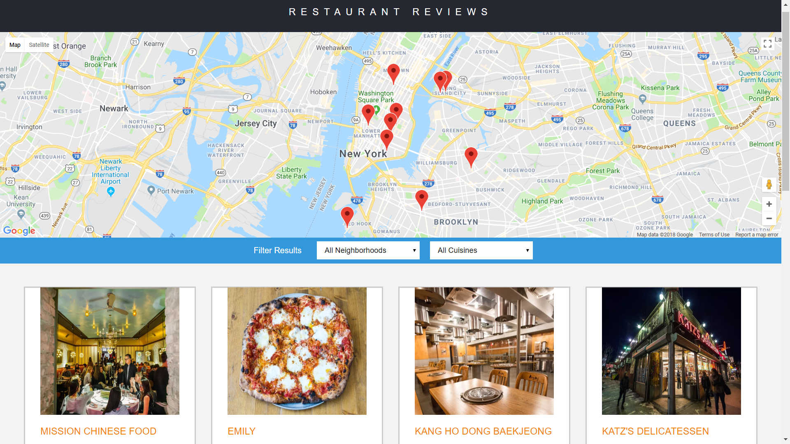

# Restaurant-Reviews

This is an application for Restaurant Reviews part of Udacity Nanodegree.

The main goals are to convert a static webpage to a mobile-ready web application, to make it accessible and to cache the data for the website so that any page that has been visited is accessible offline.

## Installation

1. Clone the repository.
2. Open the folder in a terminal.
3. Check the version of Python: python -V.
   For Python 2: python -m SimpleHTTPServer 8000 
   For Python 3: python3 -m http.server 8000
4. Visit the site in your browser at http://localhost:8000.
